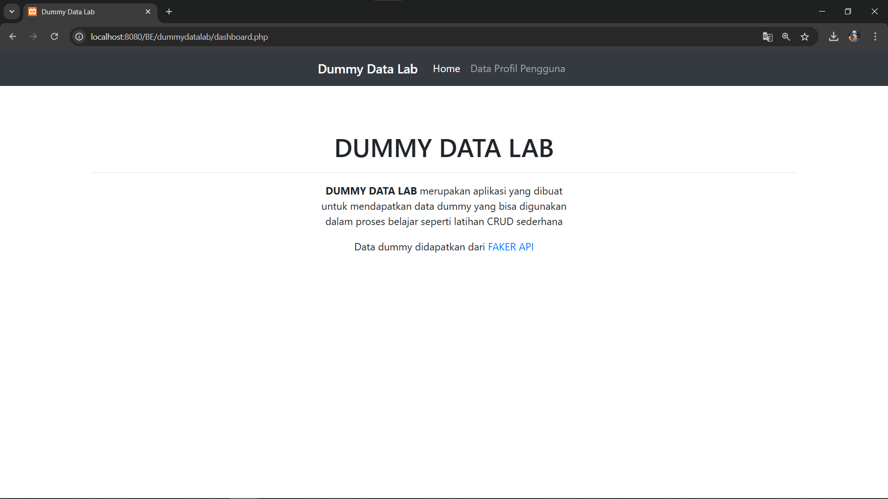
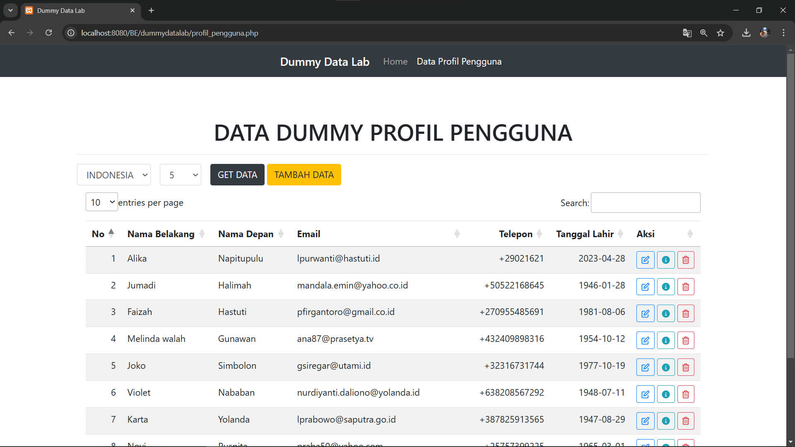

# Dummy Data Lab

Dummy Data Lab adalah kumpulan data dummy yang didapatkan dari FAKERAPI.IT, tidak hanya kumpulan data saja namun juga bisa dimanipulasi menggunakan fitur CRUD (Create, Read, Update, Delete) data yang sudah didapatkan dari api dan disimpan dalam database.

Fitur dari Dummy Data Lab

### Profil Pengguna

Fitur ini menampilkan data user yang didapatkan dari Fakerapi, kemudian datanya disimpan dalam database.
Fitur ini memungkinkan untuk bisa kita mengubah, menghapus, menambahkan data maupun menambahkan data dari fakerapi.

## Hasil Tampilan

## TAMPILAN BERANDA DUMMY DATA LAB

 <!-- Ganti dengan path ke gambar beranda Anda -->

## TAMPILAN PROFIL PENGGUNA

 <!-- Ganti dengan path ke gambar kalkulator umur Anda -->

## TEKNOLOGI YANG DIGUNAKAN

- PHP Native
- Mysql
- Ajax / Jquery
- XAMPP
- Bootstrap

## TEKNOLOGI YANG DIGUNAKAN

Cara menggunakannya adalah :

1. buatkan database dengan nama "dummydatalab"
2. import databasenya ke dalam database yang sudah dibuat sebelumnya
3. download dan extract project dummydatalab ke dalam folder htdoc
4. running xampp dan jalankan project dummydatalab
5. program siap digunakan
